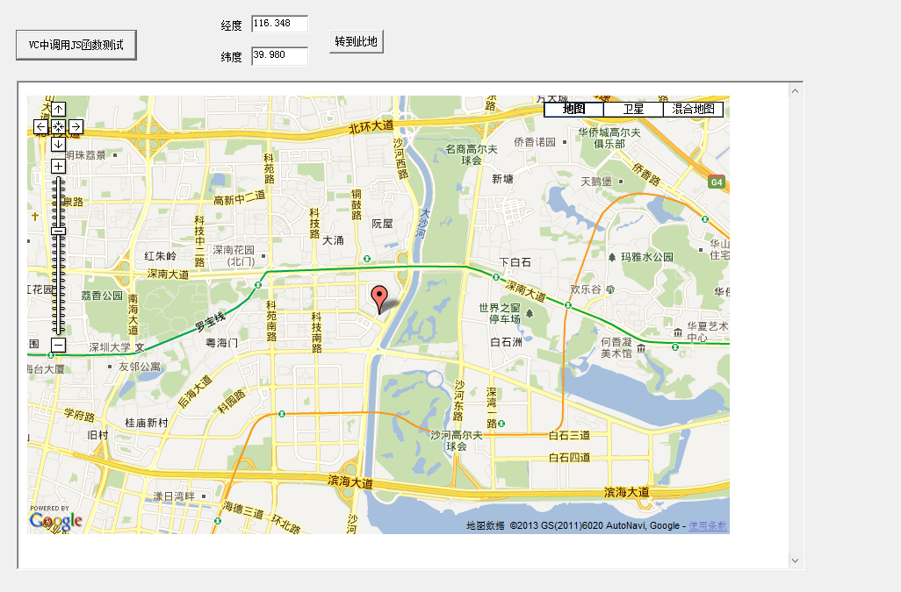

#在MFC对话框中使用Google地图(续)

在完成了基本功能以后，接下来就可以实现输入经纬度在地图中显示地点的功能了。这里就要用到VC和JavaScript的混合编程了。

如何在VC中调用JavaScript的函数，以下两个分别是CWebPage类的.h和.cpp文件：

WebPage.h

	// WebPage.h: interface for the CWebPage class.
	//
	//////////////////////////////////////////////////////////////////////
	
	#if !defined(AFX_WEBPAGE_H__AEBD50B8_EE66_40AB_8B92_C4EECB9BCD22__INCLUDED_)
	#define AFX_WEBPAGE_H__AEBD50B8_EE66_40AB_8B92_C4EECB9BCD22__INCLUDED_
	
	#if _MSC_VER > 1000
	#pragma once
	#endif // _MSC_VER > 1000
	
	#include <atlbase.h>
	#include <Mshtml.h>
	
	class CWebPage  
	{
	public:
	    CWebPage();
	    virtual ~CWebPage();
	
	    bool SetDocument(IDispatch* pDisp);
	    LPDISPATCH GetHtmlDocument() const;
	    const CString GetLastError() const;
	    bool GetJScript(CComPtr<IDispatch>& spDisp);
	    bool GetJScripts(CComPtr<IHTMLElementCollection>& spColl);
	
	    CString ScanJScript(CString& strAText, CStringArray& args);
	
	    bool CallJScript(const CString strFunc,CComVariant* pVarResult = NULL);
	    bool CallJScript(const CString strFunc,const CString strArg1,CComVariant* pVarResult = NULL);
	    bool CallJScript(const CString strFunc,const CString strArg1,const CString strArg2,CComVariant* pVarResult = NULL);
	    bool CallJScript(const CString strFunc,const CString strArg1,const CString strArg2,const CString strArg3,CComVariant* pVarResult = NULL);
	    bool CallJScript(const CString strFunc,const CStringArray& paramArray,CComVariant* pVarResult = NULL);
	
	protected:
	
	
	    void ShowError(LPCSTR lpszText);
	
	protected:
	
	    CComPtr<IHTMLDocument2>    m_spDoc;
	    CString    m_strError;
	
	};
	
	inline
	void CWebPage::ShowError(LPCSTR lpszText)
	{
	    m_strError = "JSCall Error:\n" + CString(lpszText);
	}
	inline 
	const CString CWebPage::GetLastError() const
	{
	    return m_strError;
	}
	inline
	LPDISPATCH CWebPage::GetHtmlDocument() const
	{
	    return m_spDoc;
	}
	
	CString GetNextToken(CString& strSrc, const CString strDelim,bool bTrim = false, bool bFindOneOf = true);
	
	#endif // !defined(AFX_WEBPAGE_H__AEBD50B8_EE66_40AB_8B92_C4EECB9BCD22__INCLUDED_)

WebPage.cpp

	/////////////////////////////////////////////////////////////////
	//             By Eugene Khodakovsky                           //
	//                  April,2002                                 //
	//             Eugene@cpplab.com                               //
	//            Last Update: April, 2002                         //
	/////////////////////////////////////////////////////////////////
	
	////////           WebPage.cpp
	
	#include "stdafx.h"
	//#include "JSCall.h"
	#include "WebPage.h"
	
	#ifdef _DEBUG
	#undef THIS_FILE
	static char THIS_FILE[]=__FILE__;
	#define new DEBUG_NEW
	#endif
	
	#define CHECK_POINTER(p)\
	    ATLASSERT(p != NULL);\
	    if(p == NULL)\
	    {\
	        ShowError("NULL pointer");\
	        return false;\
	    }
	
	const CString GetSystemErrorMessage(DWORD dwError)
	{
	    CString strError;
	    LPTSTR lpBuffer;
	
	    if(!FormatMessage(FORMAT_MESSAGE_ALLOCATE_BUFFER | FORMAT_MESSAGE_FROM_SYSTEM,
	            NULL,  dwError,
	            MAKELANGID(LANG_NEUTRAL, SUBLANG_SYS_DEFAULT),
	            (LPTSTR) &lpBuffer, 0, NULL))
	
	    {
	        strError = "FormatMessage Netive Error" ;
	    }
	    else
	    {
	        strError = lpBuffer;
	        LocalFree(lpBuffer);
	    }
	    return strError;
	}
	
	CString GetNextToken(CString& strSrc, const CString strDelim,bool bTrim, bool bFindOneOf)
	{
	    CString strToken;
	    int idx = bFindOneOf? strSrc.FindOneOf(strDelim) : strSrc.Find(strDelim);
	    if(idx != -1)
	    {
	        strToken  = strSrc.Left(idx);
	        strSrc = strSrc.Right(strSrc.GetLength() - (idx + 1) );
	    }
	    else
	    {
	        strToken = strSrc;
	        strSrc.Empty();
	    }
	    if(bTrim)
	    {
	        strToken.TrimLeft();
	        strToken.TrimRight();
	    }
	    return strToken;
	}
	
	//////////////////////////////////////////////////////////////////////
	// Construction/Destruction
	//////////////////////////////////////////////////////////////////////
	
	CWebPage::CWebPage()
	{
	}
	
	CWebPage::~CWebPage()
	{
	
	}
	
	bool CWebPage::SetDocument(IDispatch* pDisp)
	{
	    CHECK_POINTER(pDisp);
	
	    m_spDoc = NULL;
	
	    CComPtr<IDispatch> spDisp = pDisp;
	
	    HRESULT hr = spDisp->QueryInterface(IID_IHTMLDocument2,(void**)&m_spDoc);
	    if(FAILED(hr))
	    {
	        ShowError("Failed to get HTML document COM object");
	        return false;
	    }
	    return true;
	}
	
	bool CWebPage::GetJScript(CComPtr<IDispatch>& spDisp)
	{
	    CHECK_POINTER(m_spDoc);
	    HRESULT hr = m_spDoc->get_Script(&spDisp);
	    ATLASSERT(SUCCEEDED(hr));
	    return SUCCEEDED(hr);
	}
	
	bool CWebPage::GetJScripts(CComPtr<IHTMLElementCollection>& spColl)
	{
	    CHECK_POINTER(m_spDoc);
	    HRESULT hr = m_spDoc->get_scripts(&spColl);
	    ATLASSERT(SUCCEEDED(hr));
	    return SUCCEEDED(hr);
	}
	
	bool CWebPage::CallJScript(const CString strFunc,CComVariant* pVarResult)
	{
	    CStringArray paramArray;
	    return CallJScript(strFunc,paramArray,pVarResult);
	}
	
	bool CWebPage::CallJScript(const CString strFunc,const CString strArg1,CComVariant* pVarResult)
	{
	    CStringArray paramArray;
	    paramArray.Add(strArg1);
	    return CallJScript(strFunc,paramArray,pVarResult);
	}
	
	bool CWebPage::CallJScript(const CString strFunc,const CString strArg1,const CString strArg2,CComVariant* pVarResult)
	{
	    CStringArray paramArray;
	    paramArray.Add(strArg1);
	    paramArray.Add(strArg2);
	    return CallJScript(strFunc,paramArray,pVarResult);
	}
	
	bool CWebPage::CallJScript(const CString strFunc,const CString strArg1,const CString strArg2,const CString strArg3,CComVariant* pVarResult)
	{
	    CStringArray paramArray;
	    paramArray.Add(strArg1);
	    paramArray.Add(strArg2);
	    paramArray.Add(strArg3);
	    return CallJScript(strFunc,paramArray,pVarResult);
	}
	
	bool CWebPage::CallJScript(const CString strFunc, const CStringArray& paramArray,CComVariant* pVarResult)
	{
	    CComPtr<IDispatch> spScript;
	    if(!GetJScript(spScript))
	    {
	        ShowError("Cannot GetScript");
	        return false;
	    }
	    CComBSTR bstrMember(strFunc);
	    DISPID dispid = NULL;
	    HRESULT hr = spScript->GetIDsOfNames(IID_NULL,&bstrMember,1,
	                                            LOCALE_SYSTEM_DEFAULT,&dispid);
	    if(FAILED(hr))
	    {
	        ShowError(GetSystemErrorMessage(hr));
	        return false;
	    }
	
	    const int arraySize = paramArray.GetSize();
	
	    DISPPARAMS dispparams;
	    memset(&dispparams, 0, sizeof dispparams);
	    dispparams.cArgs = arraySize;
	    dispparams.rgvarg = new VARIANT[dispparams.cArgs];
	    
	    for( int i = 0; i < arraySize; i++)
	    {
	        CComBSTR bstr = paramArray.GetAt(arraySize - 1 - i); // back reading
	        bstr.CopyTo(&dispparams.rgvarg[i].bstrVal);
	        dispparams.rgvarg[i].vt = VT_BSTR;
	    }
	    dispparams.cNamedArgs = 0;
	
	    EXCEPINFO excepInfo;
	    memset(&excepInfo, 0, sizeof excepInfo);
	       CComVariant vaResult;
	    UINT nArgErr = (UINT)-1;  // initialize to invalid arg
	         
	    hr = spScript->Invoke(dispid,IID_NULL,0,
	                            DISPATCH_METHOD,&dispparams,&vaResult,&excepInfo,&nArgErr);
	
	    delete [] dispparams.rgvarg;
	    if(FAILED(hr))
	    {
	        ShowError(GetSystemErrorMessage(hr));
	        return false;
	    }
	    
	    if(pVarResult)
	    {
	        *pVarResult = vaResult;
	    }
	    return true;
	}
	
	// returned java script function name, input string is truncating
	CString CWebPage::ScanJScript(CString& strAText, CStringArray& args)
	{
	    args.RemoveAll();
	    CString strDelim(" \n\r\t"),strSrc(strAText);
	    bool bFound = false;
	    while(!strSrc.IsEmpty())
	    {
	        CString strStart = GetNextToken(strSrc,strDelim);
	        if(strStart == "function")
	        {
	            bFound = true;
	            break;
	        }
	        if(strStart == "/*")
	        {
	            // Skip comments
	            while(!strSrc.IsEmpty())
	            {
	                CString strStop = GetNextToken(strSrc,strDelim);
	                if(strStop == "*/")
	                {
	                    break;
	                }
	            }
	        }
	    }
	
	    if(!bFound)
	        return "";
	    
	    CString strFunc = GetNextToken(strSrc,"(",true);
	    CString strArgs = GetNextToken(strSrc,")",true);
	
	    // Parse arguments
	    CString strArg;
	    while(!(strArg = GetNextToken(strArgs,",")).IsEmpty())
	        args.Add(strArg);
	
	    strAText= strSrc;
	    return strFunc;
	}

在对话框中添加测试调用JS函数按钮，在XXXDlg.cpp中该按钮单击消息函数中加入代码如下：

	CWebPage web;
    web.SetDocument(m_webBrowser.GetDocument());
    web.CallJScript("jsfunctiontest");//调用JS中的jsfunctiontest函数

然后编译运行，点击按钮就会有一个名为来自网页消息弹出框，测试成功，实现VC和JavaScript的混合编程。

在对话框中添加两个编辑框和一个按钮，在编辑框中输入经度和纬度，点击按钮谷歌地图跳转到相应的地点。

按钮的点击消息响应函数中代码如下：

 	UpdateData(TRUE);//将控件上的值传回变量
    CWebPage web;
    web.SetDocument(m_webBrowser.GetDocument());
    //调用JS中的函数TansTo()，并传递2个参数(纬度，经度)
    web.CallJScript("TansTo", m_latitude, m_longitude);

好了，以上完成了输入经纬度在地图中显示地点的功能。

接下来就可以仔细的分析代码了。

