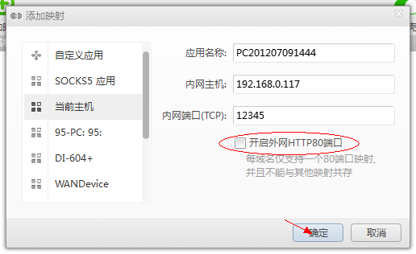
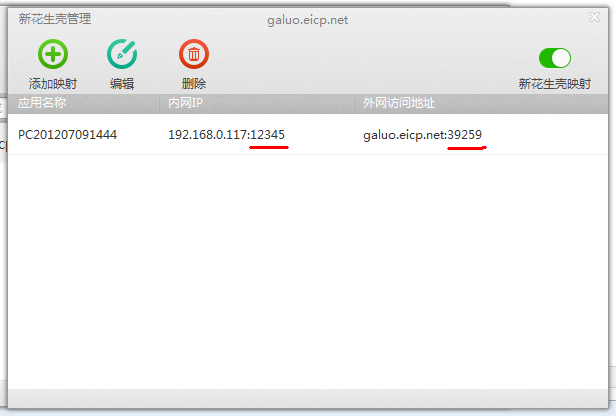
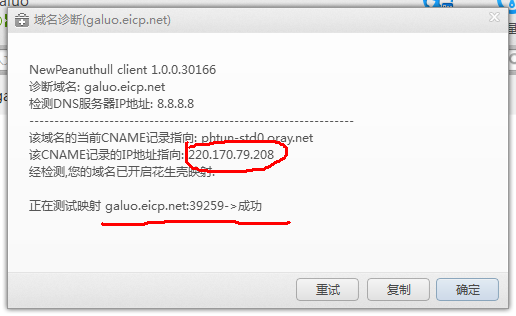

#GPRS模块调试，新花生壳+学校内网

由于使用的环境是学校的内网，所以要建立外网与学校内网的连接就要设置路由器的一个映射关系，而路由器又不是我们能够操作得了的，新花生壳解决了这一难题。下面说一说我的解决过程。
　　

我用的GPRS模块是华为公司的GTM900C，调试工具有：串口调试助手、TCP/UDP Socket调试工具、新花生壳。

首先配置新花生壳，添加映射

将GTM900C与电脑连接上以后，通过串口向它发AT指令（注意回车）：

	AT+CGATT=1
	//返回OK  附着测试
	AT+CGDCONT=1,"IP","CMNET"
	//OK  
	AT+CGREG?
	//+CGREG: 0,1   这条是确定能否连接GPRS服务
	AT%ETCPIP="user","gprs"
	//OK
	AT%ETCPIP?
	//%ETCPIP:1,"10.40.153.234",,"211.137.96.205","211.136.20.203"  查看IP等信息
	AT%DNSR="galuo.eicp.net"
	//220.170.79.208貌似免费花生壳用户都是这一个IP  域名解析
	AT%IPOPEN="TCP","220.170.79.208",39259
	//CONNECT 建立TCP连接，如果本地没有建立TCP服务监听，则会马上继续返回%IPCLOSE: 1

创建一个TCP Server，监听的端口为12345，即花生壳设置的内网端口，现在就可以收发数据了。
	
	AT%IPOPEN="TCP","220.170.79.208",39259	
	AT%IPSEND="31323334354142"

调试成功。

