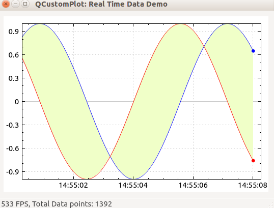
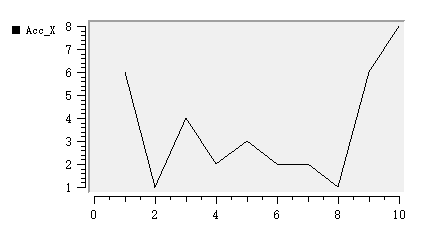

#使用QCustomPlot画实时曲线

##项目当中的实际情况

　　FID的检测信号通过信号放大电路板，然后通过主接口板的二级放大电路，到达AD采集芯片的输入端，ADS1271作为AD采集芯片通过SPI与FPGA通信，FPGA接收到AD采集芯片的数字信号，通过串口功能发送到天嵌E8（Linux+QT系统环境）的板子。现在需要将FID的检测信号的变化通过实时曲线显示出来。怎么样才能够肩负起这样伟大的历史使命呢？

##QCustomPlot与Qwt

　　从功能上来看，这两者都能够达到显示实时曲线的目的。QCustomPlot画实时曲线参照官方给出来的Real Time Data Demo，代码的注释写的很清楚，能够在自己的项目当中实现快速的调用。具体的使用例子可以参考其他的文档，[qt超强精美绘图控件-QCustomPlot一览及安装使用教程 ](http://blog.csdn.net/czyt1988/article/details/10143141)。如下图为Real Time Data Demo运行后的效果图。

　　Qwt在画实时曲线方面相对QCustomPlot来说就显得复杂一些，官方给出来的Demo也很复杂，而且官方的参考文档也是由doxygen生成的，关于如何使用说的不是很详细。Qwt的显示分为曲线图、散布图、等高线图、柱状图和刻度盘、罗盘、把手、轮子、滑块等图形控件，这里根据需求对曲线图Curve Plots深入了解。

	//曲线     
	 QwtPlotCurve * curve;  
	//X轴  
	double time[10] = {1, 2, 3, 4, 5, 6, 7, 8, 9, 10};  
	//Y轴  
	double val[10] = {3, 5, 8, 7, 2, 0, 7, 9, 1};  

	//实例化  
	curve = new QwtPlotCurve("Acc_X");  
	//加载数据  
	curve->setSamples(time, val, 10);  
	//加到plot，plot由IDE创建  
	curve->attach(ui->qwtPlot);  

　　使用一个定时器，更新数据，实时显示。

	//启动定时器，1秒响应，用于模拟产生实时数据  
	this->startTimer(1000);  
	//定时器事件  
	void MainWindow::timerEvent( QTimerEvent * ) {  
	    //所有数据前移移位，首位被覆盖  
	    for (int i = 0; i < 9; i++) {  
	        val[i] = val[i+1];  
	    }  
	    //最后一位为新数据（这里为随机数模拟）  
	    val[9] = qrand()%10;  
	    //重新加载数据  
	    curve->setSamples(time, val, 10);  
	    //QwtPlot重绘，重要，没有这句不起作用  
	    ui->qwtPlot->replot();  
	  
	}  

　　运行效果图如下所示。

##总结
　　这两种绘制实时曲线的方法，QCustomPlot在使用上相对简便，轻巧，嗯，这是我的感觉。

##参考文档

[1] [笔记Qwt显示动态实时曲线](http://tedeum.iteye.com/blog/2018706)

[2] [qt超强精美绘图控件 - QCustomPlot一览及安装使用教程](http://blog.csdn.net/czyt1988/article/details/10143141)

