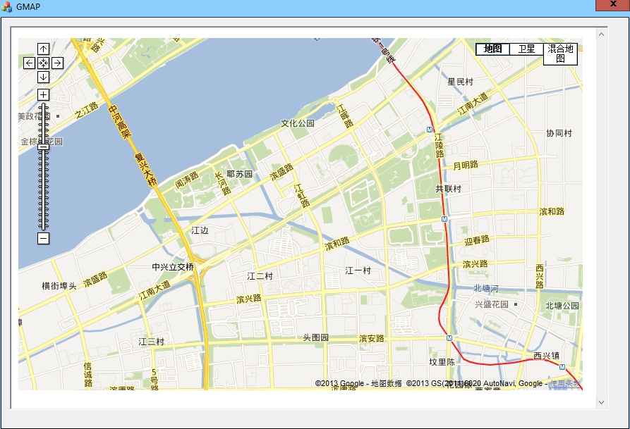

#在MFC对话框中使用Google地图

 最进实验室的项目，需要用到GPS或者北斗定位，于是乎我的上位机部分就要实现地图界面，并且实现输入经纬度值在地图中实现显示。

到网上收了很多的关于Google地图方面的应用，我知道了要用到JAVASCRIPT这个脚本语言，我是没有接触过啊，瞬间觉得亚历山大。

于是乎，用了些时间来学JS，入手了才知道，对于一个有一定C++编程经验的我来说，不算是很难（小小的自恋一下）。。。。。

看得视频是李炎恢的，这位老湿讲的非常不错。你问我是怎么来的，百度搜索—JAVASCRIPT 百度网盘，就这样搜到了，（支持百度网盘。。。。）

下面就来介绍一下网上的基本成果了：

首先建立一个对话框的工程，添加Microsoft web Browser控件到对话框上，给他定义一个control类型的变量m_explorer,在OnintialDlg中添加如下代码

	//一下几条语句是为了生成html文件的当前目录
    CHAR szPath[255];//路径
    memset(szPath, 0, sizeof(CHAR) * 255);//清空
    GetCurrentDirectory(255, szPath);//获得当前目录
    StrCat(szPath, _T("\\Google-earth.html"));//字符串串接，得到完整目录
    m_explorer.Navigate(szPath,NULL,NULL,NULL,NULL);//加载Google-earth.html页面

上面代码的第五行中有一个目录文件Google-earth.html，这个就是JS实现的了,代码如下:

	<!DOCTYPE html PUBLIC "-//W3C//DTD XHTML 1.0 Strict//EN"
	    "http://www.w3.org/TR/xhtml1/DTD/xhtml1-strict.dtd">
	<html xmlns="http://www.w3.org/1999/xhtml" xmlns:v="urn:schemas-microsoft-com:vml">
	  <head>
	    <meta http-equiv="content-type" content="text/html; charset=gb2312"/><!--注意字符集设置为：gb2312，不会出现中文乱码-->
	    <title>Google 地图 JavaScript API 示例: 地图标记</title>
	    

	
    
    

	  </head>
	  <body  onload="initialize()" onunload="GUnload()"> <!--//页面加载完成后执行initialize()函数-->
	    

<!--定义名为map_canvas的DIV-->
	  </body>
	</html>

这里面实现了什么功能，注释的就很清楚了。
编译运行程序，就可以实现最基本的功能了。

