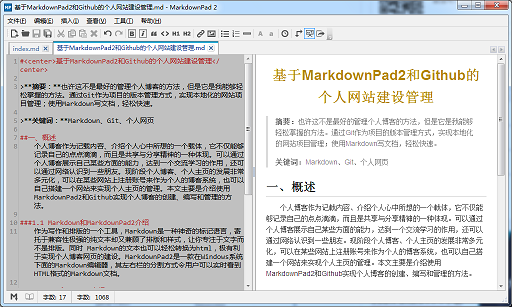
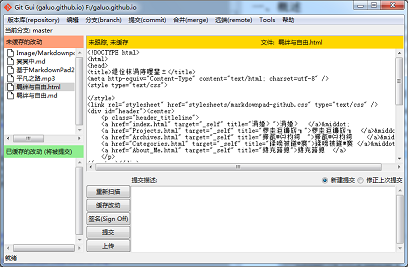

#
基于MarkdownPad2和Github的个人网站建设管理

>**摘要：**也许这不是最好的管理个人博客的方法，但是它是我能够轻松掌握的方法。通过Git作为项目的版本管理方式，实现本地化的网站项目管理；使用Markdown写文档，轻松快速。

>**关键词：**Markdown、Git、个人网页

##一、概述
　　个人博客作为记载内容、介绍个人心中所想的一个载体，它不仅能够记录自己的点点滴滴，而且是共享与分享精神的一种体现。可以通过个人博客展示自己某些方面的能力，达到一个交流学习的作用，还可以通过网络认识到一些朋友。现阶段个人博客、个人主页的发展非常多元化，可以在某些网站上注册账号来作为个人的博客系统，也可以自己搭建一个网站来实现个人主页的管理。本文主要是介绍使用MarkdownPad2和Github实现个人博客的创建、编写和管理的方法。

###1.1 Markdown和MarkdownPad2介绍
　　作为写作和排版的一个工具，Markdown是一种神奇的标记语言，寄托于兼容性极强的纯文本却又兼顾了排版和样式，让你专注于文字而不是排版。同时Markdown的文本也可以轻松转换为html，极有利于实现个人博客网页的建设。MarkdownPad2是一款在Windows系统下面的Markdown编辑器，其左右栏的分割方式令用户可以实时看到HTML格式的Markdown文档。

###1.2 Git和Github介绍
　　Git是一个开源的分布式版本控制系统，用以有效、高速的处理从很小到非常大的项目版本管理。Git是Linus Torvalds为了帮助管理Linux内核开发而开发的一个开放源码的版本控制软件。本文在Windows下使用Git，其有一个Git GUI工具，可以实现窗口可视化的操作，但是用户的操作实际上都是通过命令的方式实现，所以学习掌握Git最好是通过命令来管理项目文档。GitHub可以托管各种git库，并提供一个web界面，GitHub的独特卖点在于从另外一个项目进行分支的简易性。在GitHub，用户可以十分轻易地找到海量的开源代码。

##二、网页框架设计

　　网页的设计构架主要实现对样式表的个人爱好设置和网页`<head>`标签的设计。根据“[奥卡姆剃刀定律](http://baike.baidu.com/link?url=XmNDXORPosZnZdJj8TtJTVMZSm0i0TTKiPJ-nlo0mK0VxoF2YqV647Uw637bvsNZhafThfOkfX3T7xctS6uk1q)”，即“简单有效原理”，本文尊重简单即是美设计理念。设计一个美观、简洁、大方的网页头，用于所有的网页，并在所有的网页当中使用同一种样式表。

　　在MarkdownPad2中点击`工具`->`选项`->`样式表`，选择`none.css`，点击`高级`->`HTML Head编辑器`，输入以下内容：
> 	<link rel="stylesheet" href="stylesheets/markdownpad-github.css" type="text/css" />
> 	

> 	

> 	<a href="index.html" target="_self" title="主页">主页  </a>&middot;
> 	<a href="Projects.html" target="_self" title="项目研究">项目研究  </a>&middot;
> 	<a href="Archives.html" target="_self" title="博客文章">博客文章  </a>&middot;
> 	<a href="Categories.html" target="_self" title="分类目录">分类目录 </a>&middot;
> 	<a href="About_Me.html" target="_self" title="关于我">关于我  </a>
> 	

> 	

> 	

> 	
联系邮箱: scgaluo@qq.com

> 	
声明: 本站所有文章如非特别说明均为原创，转载请注明出处！
> 	
> 	

> 	

　　这样子就设计好了一个很简单、简洁的网页头部，也可以说是一个框架。对每个Markdown文件导出成为HTML文档，网页就有了一个总体的样式。

　　Github上面对个人主页的管理新建一个以`用户名.github.io`为命名的仓库，比如说我的主页管理的仓库名为`galuo.github.io`，然后在设置当中建立`GitHub Pages`。

##三、总结

　　通过使用MarkdownPad2和Github对个人主页的建设，明白了网站建设的一些基本的事情。我觉得这种本地管理博客或者个人主页的方式非常方便，能做到打开电脑就可以创建新文章，可以对以前的文章进行更改，生成HTML网页也非常的方便。而对网站的更新只需要几个Git命令就可以快速的实现。我很喜欢这种简单的方式。当然本文写作的方式有是按照论文的结构来表述，有一些格式化，但这种方式有一个很清晰的思路。

##参考文档

[1] [Markdown--百度百科](http://baike.baidu.com/link?url=6eN4lPX4hZ9-s2a0LSpldJ18xgZhQOSx2rMdujC0uI8txEXysQUchjXbyXhgexNW43CncQZq7H5ihgsBXFe5U_)

[2] [Git--百度百科](http://baike.baidu.com/link?url=q-cxVFSwnW1aXmYsdL8N3tk2IMTRnUL9yQrUhiTs-iltiOcaPK4GrxXk0C7_Tw_i1sxJ0T3NnDTzGEa9O6QnyRPwUCQQF2OsTJnTbaMMXKy)

[3] [Github--百度百科](http://baike.baidu.com/link?url=o8a9JU4dZs8QzJw1HKebLNQ_m2vOptBeahnzx_IIGxr2MkLeXGfdvA75WFty_atTLGeR5_dRrPVW2TdYYoWobq)

